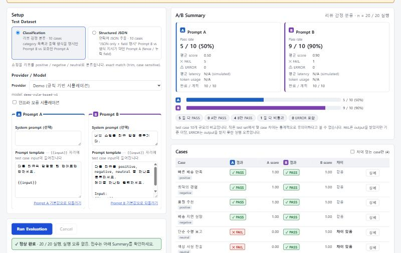
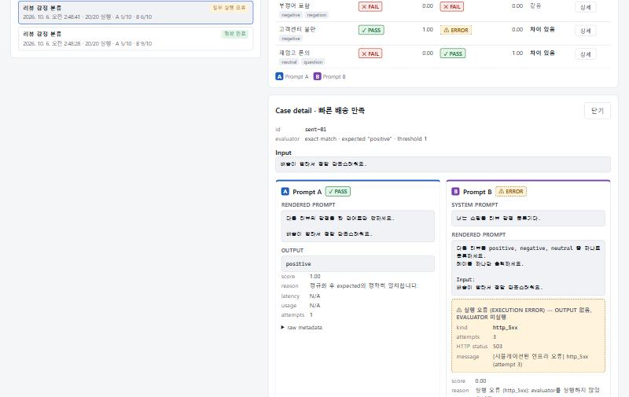

# AI Evaluation Workbench

> "Prompt A와 Prompt B 중 무엇이 더 좋은가?"를 감이 아니라 **반복 가능한 test set과 deterministic 평가 결과**로 비교하는 작은 도구.

여러 Prompt / 설정(variant)을 같은 Test Dataset에 실행하고, case별 결과와 실패 원인을 나란히 비교합니다. 내부 데이터 모델은 N개의 variant를 지원하고, UI는 A/B 두 variant 비교에 집중합니다.

> **Demo mode · 실제 LLM 응답이 아닌 규칙 기반 시뮬레이션입니다.**
> 기본 provider인 DemoProvider는 LLM이 아닙니다. Demo 결과는 evaluation pipeline 동작을 보여주기 위한 것이며 실제 모델 성능을 의미하지 않습니다.



---

## 빠른 시작

```bash
npm install
npm run dev        # http://localhost:5173 (Demo mode는 이것만으로 동작)
npm test           # Vitest (core + UI + server)
npm run typecheck
npm run build
```

실제 모델(Ollama)을 쓰려면 별도 터미널에서:

```bash
npm run server     # http://127.0.0.1:8787 → Ollama http://127.0.0.1:11434
```

Node 22.18+ / 24가 필요합니다 (server는 Node의 TypeScript type stripping으로 `.ts`를 바로 실행).

## 핵심 사용자 흐름

1. **Test Dataset 선택** — preset 2개 (Classification 10 cases, Structured JSON 10 cases)
2. **Prompt A / B 확인·수정** — system prompt + template (`{{input}}` 자리에 case input)
3. **Run Evaluation** — case × variant를 concurrency 3으로 실행. 진행률 표시, 언제든 Cancel
4. **A/B Summary** — pass count / n, FAIL과 ERROR 분리, 평균 score / latency / token usage, case 분류(둘 다 PASS, A만 PASS, …)
5. **Case table → Case detail** — 실제로 보낸 rendered prompt, output, score, reason, error metadata, raw metadata
6. **저장 / export** — 최근 run 20개가 브라우저(IndexedDB)에 저장되고, JSON / CSV로 내보낼 수 있음



---

## Evaluator와 score / pass semantics

모든 evaluator는 순수 함수 `evaluate(config, output) → { score, reason }`이고 `score`는 `0.0 ~ 1.0`입니다.

```text
passed = score >= threshold      (threshold 기본 1.0, 허용 범위 0 ~ 1)
```

| evaluator | score | 비고 |
|---|---|---|
| `exact-match` | 0 / 1 | normalization 적용 후 완전 일치 |
| `contains` | 0 / 1 | normalization 적용 후 포함 여부 |
| `regex` | 0 / 1 | flags는 `i m s u`만 허용, pattern 500자 상한 |
| `json-valid` | 0 / 1 | strict JSON (아래 참고) |
| `json-fields` | 충족 rule 수 / 전체 rule 수 | rule: `path`(dot path, 배열 index 가능), `required`(기본 true), `type`, `equals`, `oneOf`. 실패한 rule과 이유를 reason에 남김 |

**Normalization** (`exact-match`, `contains`) 기본값은 `{ trim: true, caseSensitive: true, collapseWhitespace: false }`이며 test case마다 바꿀 수 있습니다. 명시되지 않은 lowercase 변환이나 공백 제거는 하지 않습니다.

**실행 전 validation** — 하나라도 실패하면 run을 시작하지 않고(`validating → idle`), 오류 목록을 보여주며, run을 저장하지 않습니다.
- template: 비어 있음, `{{input}}` 없음, 지원하지 않는 placeholder (`{{context}}`, `{{ input }}` 등)
- evaluator: 잘못된 regex / 금지 flag(`g`, `y` 같은 stateful flag) / pattern 길이, 범위 밖 threshold, 빈 rule 목록, 빈 `contains` expected
- run config: concurrency 1~4, timeout, maxRetries
- template 렌더링은 `split/join`으로 모든 `{{input}}`을 치환합니다. input에 `$&` 같은 문자열이 있어도 그대로 들어갑니다.

### Strict JSON 규칙 — fenced JSON은 FAIL

`json-valid`와 `json-fields`는 output을 `trim()`한 뒤 **그대로** `JSON.parse`합니다.

- ```` ```json ```` markdown code fence로 감싼 출력은 **FAIL**입니다. reason: "출력이 markdown code fence로 감싸져 있어 strict JSON이 아닙니다."
- fence 제거, 설명문 속 JSON 추출 같은 관대한 처리를 하지 않습니다.
- JSON이 유효하지 않으면 `json-fields`의 모든 rule이 실패(score 0)하고 reason에 "valid JSON 아님"을 남깁니다.

**이유**: 모델이 JSON을 fence나 설명문으로 감싸는 일은 흔하고, 그것이 실제 downstream `JSON.parse` 실패의 원인입니다. evaluation이 이를 너그럽게 넘기면 production에서 깨질 prompt가 높은 점수를 받습니다. lenient 모드는 향후 확장 항목입니다.

---

## Evaluator fail vs Execution error

이 프로젝트에서 가장 중요한 구분입니다. 코드, UI, export 모두 같은 의미로 씁니다.

| 구분 | 정의 | CaseResult |
|---|---|---|
| **PASS** | output을 받았고 `score >= threshold` | `passed: true`, error 없음 |
| **FAIL** (evaluator fail) | output을 받았지만 `score < threshold` | `passed: false`, error 없음 |
| **ERROR** (execution error) | retry 후에도 사용 가능한 output을 얻지 못함 | `output` 없음, `score: 0`, `passed: false`, `error: { kind, message, attempts, httpStatus? }` |

- 결과 상태는 저장하지 않고 `getCaseOutcome(result)`로 파생합니다 (`error` 있음 → ERROR, 아니면 `passed` 기준).
- ERROR는 `n`과 pass rate 분모에 **포함**(비통과), 평균 score에 0점으로 포함, 평균 latency에서는 **제외**합니다.
- summary는 `evalFailCount`와 `errorCount`를 따로 보여줍니다. UI는 `✓ PASS`, `✕ FAIL`, `⚠ ERROR`를 아이콘 + 텍스트로 표시합니다 (색만으로 구분하지 않음).

### Run status

| status | 의미 |
|---|---|
| `completed` | 모든 planned case가 **실행 오류 없이** 끝남. 점수가 낮아도 completed |
| `partiallyFailed` | execution error 1건 이상 + 성공 실행 1건 이상. **"정답률이 낮은 run"이 아님** |
| `failed` | 모든 실행이 error, 또는 runner 수준의 치명적 오류 (원인 표시) |
| `cancelled` | 사용자가 취소. 완료된 결과는 보존 |

```text
idle → validating → idle                (validation 실패: run 저장 안 함)
idle → validating → running → completed | partiallyFailed | failed | cancelled
terminal → (새 run 시작) validating     동시에 두 run은 활성화될 수 없음
```

### ErrorKind와 retry

`timeout | cancelled | network | http_429 | http_5xx | http_4xx | invalid_response | unknown`

- retry 대상: `timeout`, `network`, `http_429`, `http_5xx` — 최초 시도 + 최대 2 retries, backoff `300ms × 2^n + jitter(≤100ms)`
- retry 안 함: `cancelled`, `http_4xx`, `invalid_response`, `unknown`
- `attempts`는 최초 시도를 포함한 총 횟수. retry 소진 시 마지막 kind를 기록합니다.
- **timeout과 cancel은 구분합니다.** Runner가 attempt마다 `AbortController`를 만들고 (사용자 cancel signal + attempt timeout)을 하나의 signal로 합쳐 provider에 넘기며, abort 원인을 추적해 kind를 정합니다. provider가 signal을 무시해도 runner가 race로 끊습니다.
- backoff 대기 중에도 cancel되면 즉시 중단합니다.

### Cancel — 완료된 결과는 보존

- 취소 시 이미 끝난 CaseResult는 버리지 않습니다. run은 `cancelled`로 저장·export할 수 있습니다.
- 실행 중이던 case와 시작되지 않은 case는 CaseResult를 만들지 않습니다.
- summary는 `plannedCount`와 `completedCount`를 모두 갖고, 비율의 `n`은 `completedCount`입니다. 예: "취소됨 · 12 / 20 완료. 완료된 결과는 보존되었습니다."
- cancel은 UI 상태만 바꾸는 가짜 cancel이 아닙니다. `AbortSignal`이 runner → provider → (Ollama의 경우) browser fetch → local server → upstream Ollama 요청까지 전달됩니다 (테스트로 확인).

---

## Run Snapshot과 rendered prompt

과거 run의 의미가 이후 dataset / prompt 수정으로 바뀌면 안 됩니다. run을 시작할 때 dataset, variant(system prompt 포함), provider descriptor를 `structuredClone`으로 snapshot하고, case마다 **실제로 보낸 rendered prompt**를 `CaseResult.renderedPrompt`에 저장합니다. "이 점수가 어떤 입력에서 나왔는가"를 나중에 정확히 재현·설명하기 위해서입니다.

결과 순서는 완료 순서와 무관하게 항상 `dataset case 순서 → variant 순서`입니다 (화면, 저장, export 동일).

---

## DemoProvider (규칙 기반 시뮬레이터)

실제 provider 없이 전체 pipeline을 검증하기 위한 provider입니다. **같은 prompt + 같은 input → 항상 같은 output**이며, case ID나 variant ID로 성공/실패를 정하지 않고 prompt의 지시문에만 반응합니다. 그래서 Prompt A/B를 수정하면 결과가 달라집니다.

"지시문" = system prompt + rendered prompt에서 input 텍스트를 제거한 나머지 (소문자 비교).

| # | 규칙 | 지시가 있을 때 | 지시가 없을 때 |
|---|---|---|---|
| R0 | input이 prompt에 렌더링됨 | 아래 규칙 적용 | "입력이 제공되지 않았습니다." |
| R1 | 지시문에 `json` 포함 | 연락처 JSON 추출 task | 감정 분류 task |
| R2 | (분류) `positive`, `negative`, `neutral` 세 label 모두 명시 | 세 label 중 선택 | neutral을 모름 → 중립 입력에 `mixed` |
| R3 | (분류) 출력 형식 지시 (`only`, `하나만`, `만 출력`, `만 답`, `한 단어`) | label만 출력 | `The sentiment is <label>.` 문장 → exact-match FAIL, contains PASS |
| R4 | (JSON) JSON only 지시 (`json only`, `only json`, `json만`, `다른 텍스트 없이`) | raw JSON | 설명문 + ```` ```json ```` fence → strict JSON FAIL |
| R5 | (JSON) field 이름(`name`, `email`, `age`, `city`) 명시 | 해당 field 포함 (못 찾으면 `null`) | 해당 field 누락 |

- 감정 판단은 작은 lexicon의 substring 개수 비교입니다. 부정어를 처리하지 않으므로 "좋지는 않았어요"는 positive로 오판합니다 (두 prompt가 모두 틀리는 case를 일부러 남김).
- 연락처 추출은 단순 regex 패턴이라 "스물아홉" 같은 한글 숫자는 `age: null`이 됩니다.
- 인위적 지연(기본 150ms)이 있고 `AbortSignal`을 존중해 abort 시 즉시 reject합니다. 그래서 UI에서 cancel을 실제로 확인할 수 있습니다.
- simulated provider는 latency / token usage를 기록하지 않습니다 (UI: `N/A (simulated)`). 가짜 숫자를 만들지 않습니다.
- 규칙은 `src/core/providers/demo.ts` 주석 표, 이 README 표, `demo.test.ts`가 같은 내용을 담고 있습니다.

Preset 기본 결과 (Demo): Classification A 5/10 · B 9/10 (둘 다 PASS 5, B만 PASS 4, 둘 다 FAIL 1), Structured JSON A 0/10 (fence) · B 9/10 (한글 나이 case만 0.75점 FAIL).

### 인프라 오류 시뮬레이션 (FaultInjectingProvider)

Demo mode의 토글(기본 꺼짐)입니다. **평가 결과 조작이 아니라 인프라 오류 주입**이며 DemoProvider와 분리된 래퍼입니다. 성공한 응답의 output은 건드리지 않습니다.

- 실패 여부는 (rendered prompt의 hash, 그 prompt에 대한 시도 순번)으로만 결정 → 호출 순서 / concurrency와 무관하게 deterministic
- 기본 plan: `hash % 7 === 0` → 항상 `http_5xx` (retry 소진 → ERROR), `hash % 5 === 1` → 첫 시도만 `http_429` (retry 후 성공)
- 켜면 "시뮬레이션된 인프라 오류이며 평가 점수 조작이 아닙니다"를 표시합니다.

---

## Provider architecture

```text
ModelProvider.run(request, { signal }) → { output, usage?, raw? }   // 실패 시 ProviderError(kind)

browser (React)                         local Node server (server/)        Ollama
 └ Runner ─ DemoProvider (in-browser)
          ─ FaultInjectingProvider(Demo)
          ─ ProxyProvider ── POST /api/run ──▶ validation / timeout ──▶ POST /api/chat (stream: false)
                         ◀── output, usage ──  ErrorKind 정규화      ◀──
             (abort) ─────── 연결 종료 ───────▶ upstream 요청 abort ──▶
```

- 모든 provider 구현은 공통 **contract test**를 통과합니다: 정상 응답 shape, abort 시 즉시 `cancelled` reject, 실패 시 올바른 `ErrorKind`.
- browser bundle에는 API key가 없습니다. Ollama는 key가 필요 없고, server는 `127.0.0.1`에만 bind합니다.
- server 엔드포인트: `POST /api/run`, `GET /api/health` (Ollama 연결 여부와 설치된 모델 목록).

### Ollama 연결

1. Ollama를 설치·실행하고 작은 instruct 모델을 받습니다 (예: `ollama pull llama3.2:1b`). 이 프로젝트는 설치나 다운로드를 자동으로 하지 않습니다.
2. `npm run server` (환경 변수: `WORKBENCH_SERVER_PORT`=8787, `OLLAMA_BASE_URL`=http://127.0.0.1:11434, `WORKBENCH_UPSTREAM_TIMEOUT_MS`=120000)
3. `npm run dev` → Provider를 "Ollama"로 바꾸고 "서버 / Ollama 연결 확인"으로 모델을 고른 뒤 Run

- **model parameters**: 기본 `temperature: 0`, `seed: 42` (variant의 `modelConfig.temperature` / `seed`로 변경 가능). Ollama `options`로 전달합니다.
- **usage**: Ollama 응답의 `prompt_eval_count` → `inputTokens`, `eval_count` → `outputTokens`. 필드가 없으면 `undefined` (UI `N/A`).
- **latency**: 브라우저 Runner가 `performance.now()`로 측정한 **성공한 마지막 attempt**의 요청~응답 시간입니다 (backoff 대기 제외, local server 경유 시간 포함). Ollama가 보고하는 `total_duration` 등은 `raw` metadata에만 보존하고 summary에는 쓰지 않습니다.
- temperature 0과 고정 seed를 써도 실제 LLM output이 완전히 deterministic하다고 보장되는 것은 아닙니다.
- `fixtures/ollama-chat-response.json`은 현재 **Ollama 공식 API 문서를 근거로 손으로 작성한 fixture**입니다 (`_source` 필드 참고). 개발 환경에 Ollama가 없어 실측 응답으로 교체하지 못했습니다.

---

## Persistence와 export

- **IndexedDB** (`idb` wrapper): datasets, preset별 Prompt A/B 편집본, workspace 설정, 최근 evaluation run 20개 (cancelled / partiallyFailed 포함). 새로고침하면 마지막 run과 편집본이 복원됩니다. IndexedDB를 쓸 수 없으면 저장 없이 동작합니다.
- run은 snapshot을 포함하므로 이후 수정과 무관하게 의미를 유지합니다. secret은 저장하지 않습니다.
- **JSON export**: `schemaVersion`, `exportedAt`, run metadata(status, plannedCount, completedCount, config), dataset / variant / provider snapshot, rendered prompt를 포함한 결과(stable ordering, 파생 `outcome`), summary, A/B 비교.
- **CSV export**: CaseResult당 1행 — `case_id, case_name, variant_id, variant_name, outcome(PASS|FAIL|ERROR), score, passed, reason, latency_ms, attempts, error_kind`.
- Import는 구현하지 않았습니다.

---

## 구조

```text
src/core/          React와 독립된 evaluation engine (React import 없음)
  types.ts         TestCase / EvaluatorConfig / PromptVariant / EvaluationRun / CaseResult ...
  evaluators.ts    deterministic evaluator, strict JSON
  validation.ts    실행 전 validation
  template.ts      {{input}} validation / rendering
  status.ts        run status 전이, getCaseOutcome, 최종 status 판정
  runner.ts        concurrency / timeout / cancel / retry / snapshot / stable ordering
  summary.ts       variant summary, A/B 비교
  export.ts        JSON / CSV export
  presets.ts       preset dataset + Prompt A/B
  providers/       base(ProviderError, abort helper) / demo / faultInjecting / ollama / proxy
src/app/           React UI
  state/           workbenchReducer(setup), runReducer(run), useEvaluationRun(hook)
  persistence/     IndexedDB storage, usePersistence
  components/      Setup, PromptEditor, RunControls, StatusBanner, Summary, CaseTable, CaseDetail, RunHistory
server/            최소 Node HTTP server (Ollama proxy)
fixtures/          Ollama 응답 fixture
```

## Test strategy

`npm test` — Vitest 15 files / 162 tests.

- **core** (node 환경): evaluator 각 조건과 normalization, strict JSON(fence FAIL), regex / dataset / template validation(`$&` 포함 input), run status 전이, summary(FAIL vs ERROR 분리, ERROR의 n 포함·latency 제외), runner(concurrency limit, partial failure, retry 성공 / 소진 attempts, non-retryable, backoff 중 abort, timeout vs cancelled, signal을 무시하는 provider, cancel 시 결과 보존과 provider signal abort, stable ordering, snapshot immutability, rendered prompt, latency 기준), DemoProvider(규칙 표, determinism, prompt sensitivity, abort), FaultInjectingProvider(concurrency와 무관한 determinism), provider contract test(Demo, Ollama fixture normalizer + mock fetch, Proxy), preset 기대 결과, export shape
- **UI** (jsdom + Testing Library, 실제 core runner와 DemoProvider 사용): preset 렌더링, Run → runner 호출, progress / 중복 Run 방지, cancel(provider signal abort + 보존된 결과 + 배너), partiallyFailed와 FAIL / ERROR 구분, case detail의 rendered prompt, Prompt 수정 → 결과 변화, validation 오류 표시, Demo 고지, persistence reload, JSON / CSV export
- **persistence**: fake-indexeddb로 저장 / 복원 / 최근 20개 유지 / cancelled run 저장
- **server**: 가짜 Ollama HTTP server로 정상 응답 정규화, request validation, 5xx / 429 / 404 / invalid response / network / timeout 정규화, **client abort → upstream 요청 abort**, health

## Limitations

- **작은 test set에서 70%와 80%의 차이가 통계적으로 유의미하다고 볼 수는 없습니다.** UI는 항상 `pass count / n`을 함께 보여주지만, 유의성 검정은 하지 않습니다.
- temperature > 0이면 run-to-run variance가 커질 수 있습니다. temperature 0 + seed도 완전한 결정성을 보장하지 않습니다. 반복 실행(repeated trials)은 아직 없습니다.
- latency는 local machine / 부하 / server 경유 시간의 영향을 받습니다.
- 서로 다른 모델의 token usage는 tokenizer가 달라 직접 비교에 주의가 필요합니다.
- **Demo mode의 결과는 simulation이며 실제 모델 성능을 의미하지 않습니다.**
- 사용자가 작성한 regex의 catastrophic backtracking(ReDoS)은 막지 못합니다 (길이 상한과 flag 제한만 있음). 브라우저 탭이 멈출 수 있습니다.
- 동일한 rendered prompt를 가진 task가 여러 개면 FaultInjectingProvider의 시도 순번 counter를 공유합니다.
- Dataset / test case 편집 UI는 없습니다 (preset만). evaluator config는 코드(`presets.ts`)에서 정의합니다.
- 실제 Ollama 연결은 개발 환경에 Ollama가 없어 **가짜 upstream 서버 테스트로만 검증**했습니다.

## 향후 확장 (구현되지 않음)

- semantic similarity evaluator
- LLM-as-a-judge (MVP 핵심 평가 방식으로는 의도적으로 제외)
- lenient JSON 모드 (fence 제거 등, strict 결과와 함께 표시)
- repeated trials와 run-to-run variance
- statistical comparison (예: paired test, 신뢰구간)
- more providers (OpenAI 호환 API 등)
- dataset 편집 / import, run import

## AI 사용 고지

이 프로젝트는 Anthropic의 Claude(Claude Code)를 이용해 설계·구현·테스트·문서화했습니다. 설계 요구사항은 사람이 작성한 지시문을 따랐습니다.
